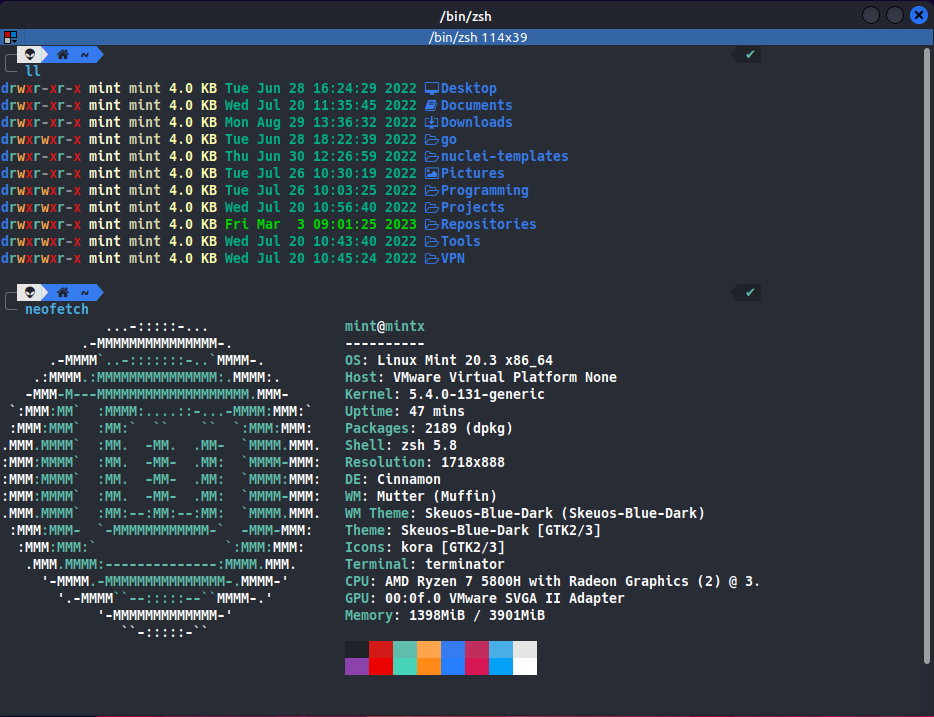

# pimp-my-terminal

Customized zsh terminal for Linux.



## Automatic Installation

The easiest way to customize your terminal is by executing the file *install.sh*:

```bash
./install.sh
```

## Manual Installation

### ZSH

The first step is to install *zsh* and change the default shell from *bash* to *zsh*:

```bash
sudo apt update && sudo apt install zsh
chsh -s /bin/zsh
```

### Custom Font

It is recommended to install the *Hack Nerd Font* on your system.

1. Download:

```zsh
wget -O Hack.zip https://github.com/ryanoasis/nerd-fonts/releases/download/v2.1.0/Hack.zip
```

2. Unzip the downloaded file into the *.fonts* directory:

```zsh
mkdir -p ~/.fonts
unzip Hack.zip -d ~/.fonts
```

### LSD

lsd is the next gen ls command. To install it:

```zsh
sudo apt install lsd
```

### BAT

Bat is a cat clone with syntax-highlighting and Git integration. To install it:

```zsh
sudo apt install bat
```

### POWERLEVEL10k

It creates a custom colorized prompt.

1. Clone the repository

```zsh
git clone --depth=1 https://github.com/romkatv/powerlevel10k.git
sudo mv powerlevel10k /usr/share
```

### Autosuggestions

It shows suggestions while typing. To install it:

```zsh
sudo apt install zsh-autosuggestions
```

### Syntax Highlighting

It provides syntax highlighting. To install it:

```zsh
sudo apt install zsh-syntax-highlighting
```

### Copy dotfiles

The last step is to copy the files .zshrc and .p10k.zsh in the home directory:

```zsh
cp .zshrc ~/
cp .p10k.zsh ~/
```
